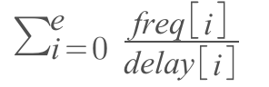

# DA-MPI

### Design

MPI’s most common use case is in High-Performance Computing (HPC). As many HPC tasks are time-critical (e.g. weather prediction), small optimizations can be extremely valuable. 

The MPI specification — and presumedly most implementations — allow MPI clusters to be distributed across cores within a machine, machines within a network (LAN), and networks within other networks (WAN). This means that there can be some degree of variability in the speeds of the links between processes. Also, It is usually the case that different MPI nodes will communicate with each other at different frequencies. Some might be coupled together with data dependencies, while others remain completely independent. The ones that talk a lot should be closer together (paired by faster links) to improve performance.

DA-MPI is a library for MPI applications that allows them to dynamically reconfigure themselves based on the communication delays in the links between compute nodes. DA-MPI starts by profiling the system that it will run on, running a series of ping-pong trials to measure communication delays between nodes. For 3 nodes, the profiling system might output something like this:
```
0 <---> 1: 0.000101
0 <---> 2: 0.000046
1 <---> 2: 0.000008
```
After it has found latencies between nodes, it determines which node is the best-connected node (the one with the least total delay across its edges). This node is be used to store some centralized runtime information, such as inter-node communication frequencies, and some information about migration requests (more on this in a second). All nodes in the cluster update the information held by the best-connected node via an MPI window that is setup at startup. For instance, a node will increment a counter in a frequency array on the best-connected node every time it performs a send operation.

Nodes use the information stored at the best-connected node regularly to determine whether or not they should perform a migration. At regular intervals nodes enter a function (`DAMPI_Airlock`) where they make this decision. Every assignment of ranks to processes has a value, defined as:
 


`e` is the number of edges in the network, `freq[i]` and `delay[i]` are the communication frequency and measured delay on edge `i`.

Nodes compute this value for all configurations that could be acheived with a single migration. If a node detects a configuration that has a higher value than the current one, it will post a migration request at the best-connected node. When all the other nodes enter the migration-checking zone (`DAMPI_Airlock`), they see that another node has requested a swap and act accordingly (described below).

At startup, all nodes register which function they will be running during their lifetime in the MPI pool. They also indicate the size of their 'suitcase' which holds all of a given node's state that needs to be carried across processes. During a migration, all nodes update their rank->process mapping so that they know where each rank is running (for the purpose of sends and recvs). The migrating nodes exchange their 'suitcase', and start running their migrating partner's function.

In order to send and recv, nodes use thir rank->process mapping. For example, if rank 0 wants to send a message to rank 1, it needs to first look up where rank 1 is running before it can perform the send. This part is best explained by the code:

 ```
 int DAMPI_Send(const void *buf, int count, MPI_Datatype datatype, int dest, int tag, MPI_Comm comm) {
  if (info->proc != dest) {
    int inc = 5; 
    MPI_Win_lock(MPI_LOCK_EXCLUSIVE, info->bnode, 0, info->freqwin);
    MPI_Accumulate(&inc, 1, MPI_INT, info->bnode, eoffset(dest, info->rank), 1, MPI_INT, MPI_SUM, info->freqwin);
    MPI_Win_unlock(info->bnode, info->freqwin);
  }
  return MPI_Send(buf, count, datatype, info->rankprocs[dest], tag, comm);            
} 
 ```
The node updates the frequency of its communication with `dest` at the best-connected node, and then calls `MPI_Send` with `rankprocs[dest]`, which tells it where dest is running in the network.

To test the system, I implemented a prime sieve both with and without the DA-MPI library. I immediately realised that profiling the system every time before running the MPI application is pointless since the physical system is unlikely to change between executions. So I separated the delay profiling system out - its cost can be amortized across all executions on the same system. It does the original delay-measuring and then writes the results to a file that can be used by other DA-MPI applications.

### Results

Obviously, since DAMPI adds some synchronization of processes and an exponential-time algorithm to check for migrations, there are significant overheads. Without DA-MPI, finding 5 primes on a single machine with tiny latencies took an average of `0.154s`, while it took `0.190s` with DA-MPI. 

I added some artificial latencies to simulate a situation where the MPI communication is distributed across links with variable-sized (and larger) delays. With latencies randomly distributed between 0 and 1 second, generating 10 primes took `22.064s` on average without DA-MPI, and `18.628s` on average with DA-MPI. The more time-intensive the application, and the more variance there is in inter-node delays, the more advantageous migrations become. For 11 primes, the sieve without DA-MPI took on average `44.311s` and the one with DA-MPI took `27.856s`. 

There are unlucky cases where the non-migratable application configures itself nearly perfectly. In the case of the prime sieve and presumably many other applications, the communication patterns between nodes is likely to remain constant even if the actual data does not (e.g. The generator node always sends messages to rank 1 to filter new numbers). I decided to create an example where the optimal configuration is determined in one run of the application and written to a file that is used by subsequent runs to configure the rank->process mapping. To find 11 numbers in a system with random delays as above, the static, optimally-configured version took `20.957s`. 

There are also cases (which may not be that realistic) where some edges are very slowly. An example might be two or more clusters spread out across continents. To simulate this situation, I made a few edges have a 1 second delay, while leaving all of the rest without artificial delays. To generate 12 primes, the sans-DA-MPI implementation took `23.378s`, the dynamic DA-MPI implementation took `2.501s` and the static one took `0.296s`. DA-MPI reconfigures the system to avoid the slowest links when communicating between nodes connected by the sieve pipeline.


### Improvements

There are a few improvements that could be made to DA-MPI. 

Firstly, one of the biggest time drains that DA-MPI introduces is in the synchronization of processes during regular calls to `DAMPI_Airlock`. A method to allow migrations to occur with less process synchronization might be advantageous. At one point in the implementation of DA-MPI, nodes were called to the airlock whenever a migration was requested. This required adding timeouts to sends and receives and would complicate library usage, so I dropped it (`commit 491afd966e6af74b04a898f84c90ae94fd624c1e`), but it might have in fact been the way to go as far as performance is concerned.

Secondly, a smarter method of checking for migrations would likely yield a performance improvement. The current method checks every possible configuration at each step, which is exponential in the number of nodes when all the nodes' operations are considered. Some sort of heuristic alternative could work better - for instance, where possible, putting the two most frequently communicating nodes on the fastest link, the second most frequently communicating nodes on the second fastest, and so on, using something like a max-heap for the frequency table.
